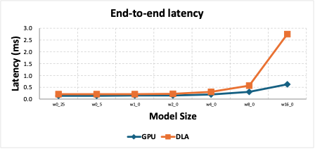
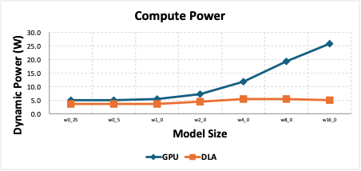

# 이수민.최종과제.rps.nvdla.project

## 제출자

- 이수민
- GitHub 계정: `s0o0omin`

## 프로젝트 제목

Jetson AGX Orin에서 INT8 RPS 모델의 GPU와 NVDLA 실행 특성 비교

## 프로젝트 요약

가위바위보 이미지 분류 모델을 INT8로 양자화하고, Jetson AGX Orin에서
TensorRT GPU-only 경로와 strict DLA 경로를 비교한 프로젝트다. 모델의
convolution channel width를 변화시키면서 정확도, end-to-end latency,
compute-rail power 및 추론당 에너지를 측정하였다.

실험 결과 batch 1 latency는 모든 모델에서 GPU가 더 낮았지만, idle 대비
증가한 compute power는 모든 모델에서 DLA가 더 낮았다. 따라서 DLA는
단일 요청 latency를 줄이기 위한 장치라기보다 GPU 연산을 낮은 전력
영역으로 offload하기 위한 보조 가속기로 해석하였다.

## 제출 구조

```text
이수민.최종과제.rps.nvdla.project/
|-- README.md
|-- source/
|   |-- README.md
|   |-- config/
|   |-- environment/
|   `-- scripts/
|-- docs/
|-- figures/
|-- results/
|-- models/
`-- data/
```

## 핵심 결과



모든 width에서 GPU latency가 더 낮았다. w16에서는 GPU `0.629 ms`,
DLA `2.753 ms`로 DLA가 약 `4.37x` 느렸다.



반면 idle 대비 동적 compute power는 모든 width에서 DLA가 더 낮았다.
w16에서는 GPU `25.80 W`, DLA `5.00 W`로 DLA가 약 `80.6%` 낮았다.

## 모델 및 데이터 다운로드

50MB 이상의 모델과 전체 이미지 데이터셋은 저장소에 직접 포함하지
않았다. 다음 스크립트가 모델 release asset과 공개 dataset 저장소를
다운로드한다.

```bash
./models/download_models.sh all
./data/download_dataset.sh
```

TensorRT engine은 JetPack, TensorRT 및 장치에 종속되므로 배포하지 않고
ONNX 모델로부터 Jetson에서 다시 생성한다.

## 실행 방법

전체 환경 구성과 재현 절차는 다음 문서를 따른다.

```text
source/README.md
docs/experiment_protocol.md
docs/results_interpretation.md
```

## 포함된 결과

- `results/native_strict_dla32_sweep_summary.csv`
- `results/power_latency_summary.csv`
- `results/power_latency_comparison.csv`
- `results/rps_gpu_dla_power_latency_sweep.xlsx`
- GPU/DLA TensorRT layer 정보와 `trtexec` profile 요약
